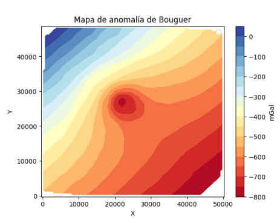
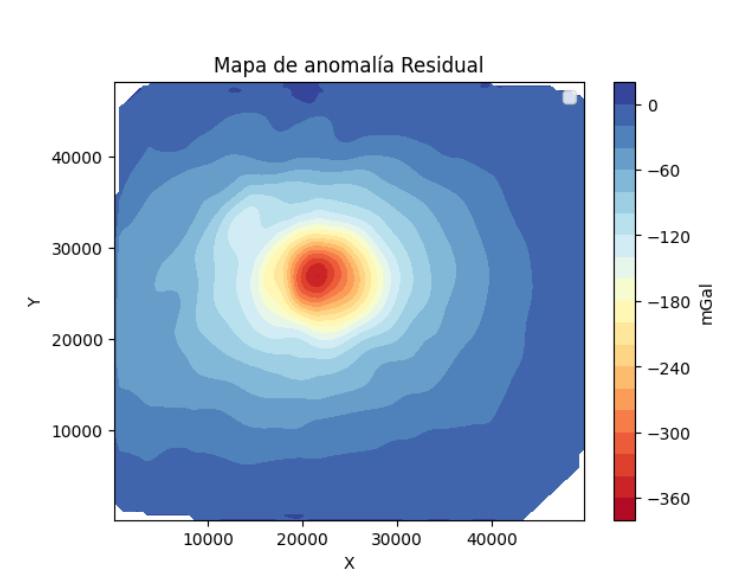

# ***Residual and regional anomaly in gravity or magnetic methods***
## Cálculo de anomalía regional y residual mediante python
***
 

*Los datos ingresados no son propiedad del autor*

Este código pretende facilitar el calculo de la residual y la regional usando software libre, como lo es Python.

# **¿Como Funciona?**

Este script lee un archivo excel, el cual debe tener 3 columnas llamadas 'x', 'y', 'z', no importa el orden el cual puede conter una malla de puntos, o puntos desordenados que posteriormente el programa va a interpolar para generar un grafico de previsualización. El programa genera perfiles horizontales o verticales, hace una regresion polinomial para ajustar una ecuación al perfil y ademas genera la ecuación del regional. El programa entrega dos graficos, uno con la anomalía residual y otro con la anomalia regional.

***
Algunos requisitos:
```
Python 3.10.x
pandas==1.4.3
numpy==1.22.2
scipy==1.9.1
matplotlib==3.5.1
matplotlib-inline==0.1.6
```
***
# ¿Como Citar? (Cite this article)
Mejía, Juan (2023). PROGRAMACIÓN APLICADA a LA GEOFÍSICA: PYTHON PARA MÉTODOS GRAVIMÉTRICOS, UNA ALTERNATIVA ÉTICA a LOS. . . ResearchGate. https://doi.org/10.13140/RG.2.2.26663.11687

***